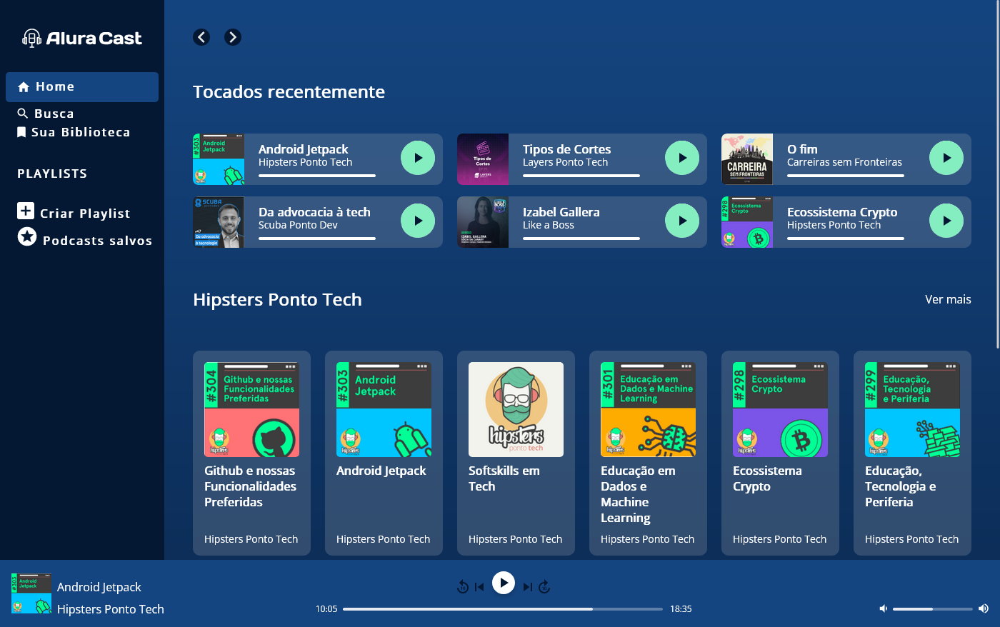
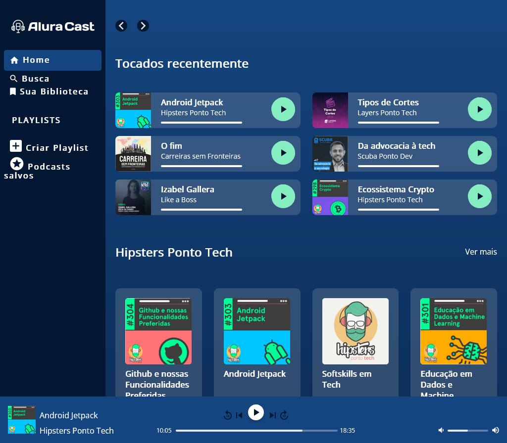
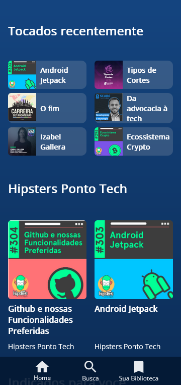

# README.md

## 📌 Introdução

Layout do site AluraCast, desenvolvido através do curso de front-end pela plataforma Alura, utlizando diversos conceitos e boas práticas com Grid.

## 🔍 Sobre a interface

## Construção da interface com HTML e CSS

A interface foi construída utilizando as tecnologias HTML e CSS. O layout foi criado com base em diversos conceitos de Grid, por exemplo:

- Sobre Grid Container vs Grid Item;
- Aplicação das propriedades display: grid, grid-template-areas, grid-area e grid-template-columns;
- Uso da unidade de CSS fr;
- Contagem de Grid Lines por meio de traços horizontais e verticais;
- Aplicação das propriedades grid-column, grid-column-start, grid-column-end, grid-row, grid-row-start, grid-row-end e grid-template-rows;
- Trabalho simultâneo com as linhas e colunas;
- Aplicação de espaçamentos entre linhas e colunas com a propriedade gap;
- Alinhamento de grid items vertical e horizontalmente com as propriedades justify-self, align-self e align-items;
- Uso da função repeat() para padrões que se repetem.

## Responsividade

O projeto foi otimizado para adaptação em telas de 360px e 1024px com o uso da função minmax(), do repeat count: auto-fit e do gap na largura das colunas. Também foram aplicadas variáveis de CSS e usos avançados da função minmax() para uma melhor otimização.

## 📲 Midia

### Interface em 1400px, 1024px, 360px, respectivamente:

## 1400px

## 1024px

## 360px

## 🚀 Conclusão e próximos passos

Este projeto foi uma ótima oportunidade para desenvolver meus conhecimentos em HTML e CSS, especialmente em relação aos conceitos e boas práticas do Grid.

Como próximos passos, pretendo explorar outras tecnologias front-end e aplicar novas técnicas em projetos pessoais. Também gostaria de aprimorar minhas habilidades em design e usabilidade para criar interfaces ainda mais atraentes e funcionais.

Agradeço à plataforma Alura por disponibilizar um curso tão completo e prático sobre front-end, e espero continuar aprendendo com a comunidade de desenvolvedores. Caso queira saber mais sobre mim ou entrar em contato, fique à vontade para acessar meu perfil no LinkedIn: https://www.linkedin.com/in/rubens-fs/.